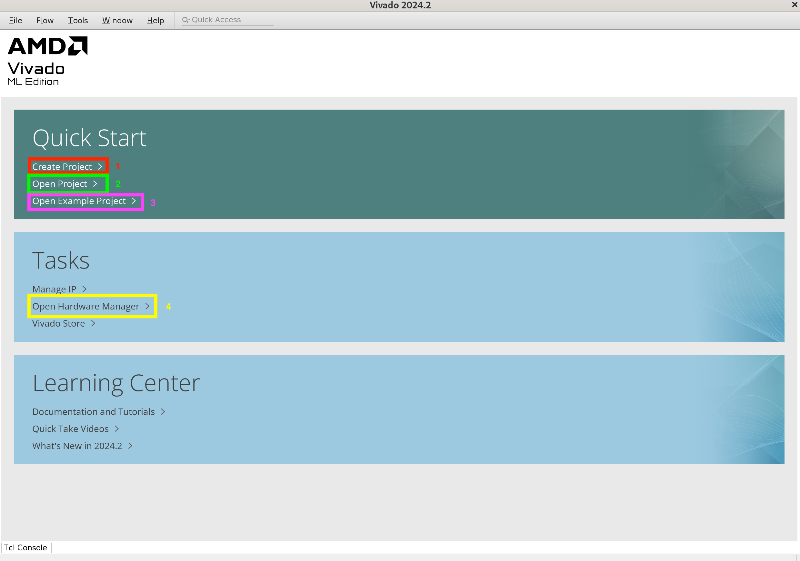
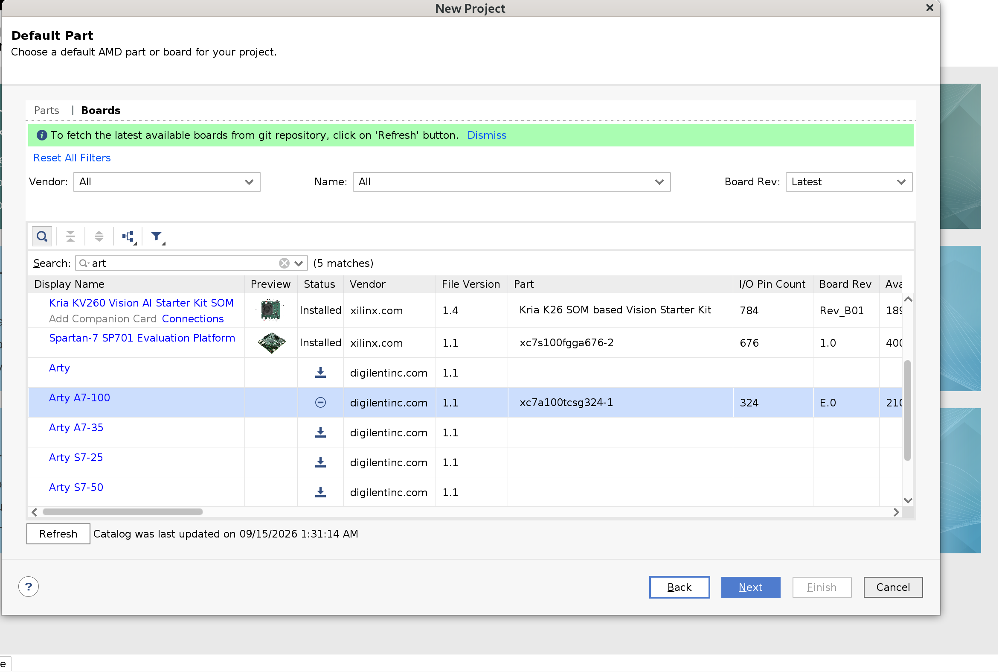
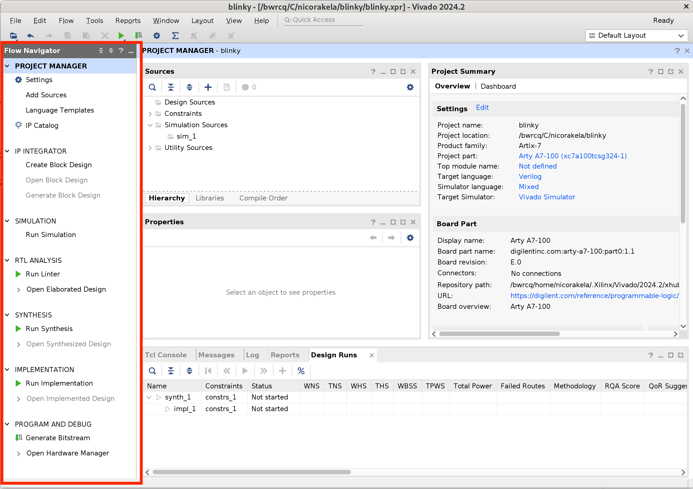
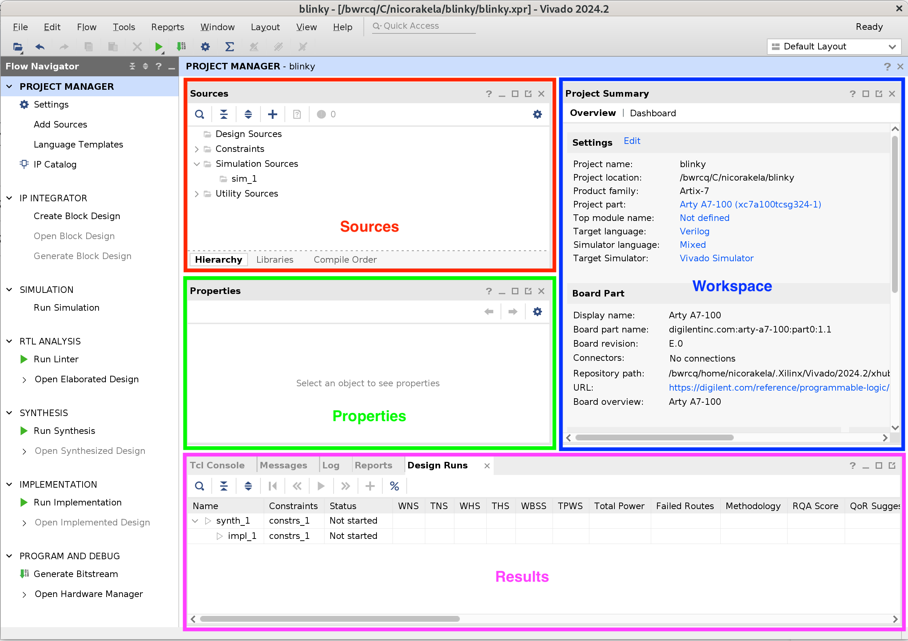
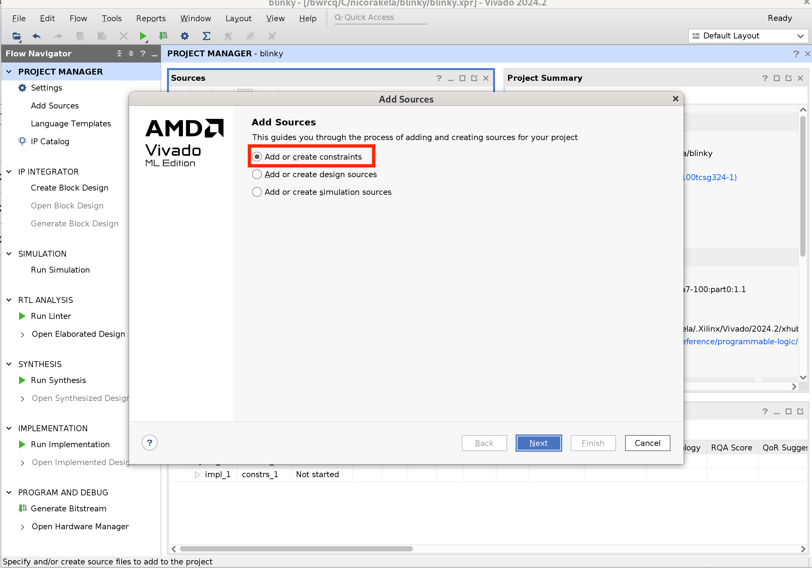
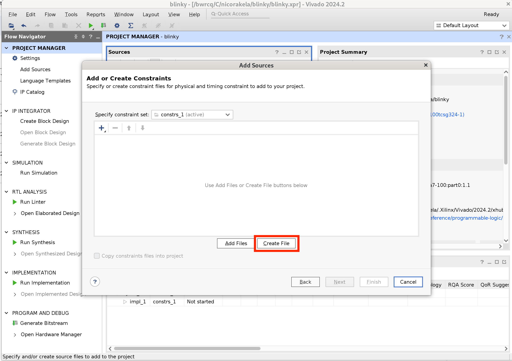
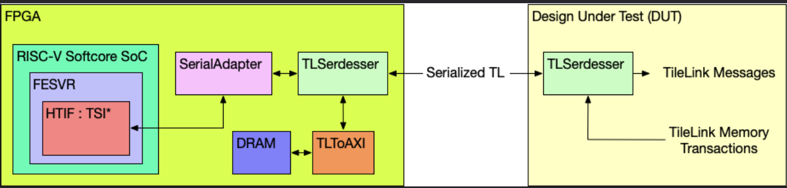

# Bringup FPGA Lab

Welcome to the FPGA lab for Bringup. In this lab, you will learn how to create FPGA projects from scratch. We will start learning about FPGAs, clocking, constraints, and we will make LEDs blink ("Hello World" equivalent in FPGA world). Then we will learn how to use FPGAs in the Chipyard environment to facilitate bringup and any other use case you have in mind.

## Materials

- FPGA: Arty A7 100T
- Tool Version: Vivado 2024.2

# Background

## What is an FPGA?

A Field Programmable Gate Array is a device that lets you implement arbitrary digital logic at runtime. Modern FPGAs have a 2D array of Configurable Logic Blocks (CLB) connected by a programmable mesh network. Inside a CLB, logic functions are stored as truth tables in small SRAMs called LUTs, and each LUT is bundled with a flip-flop so you can build sequential logic.

The FPGA is not just LUTs and routing. Around the CLB fabric you can find other resources you can use instead of building your own. This saves you a lot of LUT area, power and time:

|Resource|What it replaces|Why you care|
|---|---|---|
|Carry chains|LUT-based ripple adders|Dedicated fast paths inside a SLICE, no global routing|
|Block RAM|Registers or LUT-RAM|Dense dedicated memory|
|DSP tiles|Arithmetic blocks built from LUTs|A large multiply in one tile instead of a deep, slow LUT tree|
|MMCM / PLL|Nothing you can build|The only correct way to make a new clock frequency|
|IO blocks|Nothing you can build|Voltage levels, IO standards, DDR flops, SERDES, delay lines|

## Programming an FPGA

When you program an FPGA you are loading a bitstream that sets every LUT truth table, routing switch, and block's configuration registers. This is just data, and it only lasts while the device is being powered. Power-cycling the board will clear the FPGA unless something (an onboard flash, a host over JTAG, etc.) reloads it.

## Clocking

FPGAs don't route clocks over normal programmable routing. Clock signals need low skew and high drive across the entire die. Imagine sending the same clock signal to 100,000 flops that need to see the clock edge at the same time across all the switches of programmable routes. The skew would be huge. Instead, FPGAs have small number of dedicated global clock routes. You can reach them through buffer primitives (`BUFG`, `BUFGCE`, `BUFGCTRL`), and only certain clock-capable input pins connect to them. New frequencies come from an MMCM or PLL. An MMCM multipliers the input clock up to an internal Voltage Controlled Oscillator (VCO) and divides that down to several outputs, each with its own divider and phase.

## Constraints

When we write RTL, we describe the behaviour of the circuit, but we do not express any information about the frequency that we want to run, or which physical pin a port maps to. All of this information, including pin voltage, timing paths, etc. lives in constraint files.

Timing constraints are written in SDC (Synopsis Design Constraints), a TCL-based industry standard. You may also see XDC files (Xilinx Design Constraints), which are used in Vivado flows. XDC is an extension of SDC, meaning that they can take SDCs as a compatible input. Examples of TCL in SDCs include

1. clock definitions:
    - `create_clock -name sys_clk -period 10.0 [get_ports clk]`
    - `create_generated_clock ‑name gen_clk ‑source sys_clk ‑divide_by 2 [‑multiply_by <arg>]`
2. IO timing:
    - `set_input_delay -clock sysClk 4 [get_ports DIN]`
    - `set_output_delay -clock sysClk 1 [get_ports DOUT]`
3. exceptions (specify what times are not real and not timed):
    - `set_false_path -from <obj> -to <obj> -through <obj>`
    - `set_clock_groups -name async_clk0_clk1 -asynchronous -group {clk0 usrclk itfclk} -group {clk1 gtclkrx gtclktx}`

## The FPGA Flow

1. **Synthesis** maps RTL onto device primitives. This is where _inference_ happens: write a multiply and get a DSP tile, write a synchronous-read memory and get a BRAM. Inference is what keeps your RTL portable across vendors and back to ASIC, but it only works if you write in the patterns the tool recognizes. A memory with asynchronous read will not become a BRAM, it will become a pile of LUTs.
2. **Optimization** (`opt_design`) cleans up the netlist and gives you initial utilization numbers.
3. **Placement** assigns each primitive to a physical site. Congestion and realistic timing become visible.
4. **Physical optimization** (`phys_opt_design`) attempts to improve timing by moving and replicating logic.
5. **Routing** connects everything through the switch fabric.
6. **Bitstream generation** emits the `.bit` file.

# Getting Started with Vivado - Blinking an LED

## Setting up the Project

Now we will create a Vivado project from scratch and make an LED blink.

First, lets open Vivado. You should be using the lab machines for this. If you decide to use your own device for vivado, make sure you are using a compatible version. Staff will not be able to help you if you have issues with your setup on your own computer.

In one of the lab machines, open Vivado 2024.2.

```sh
source /tools/commercial/xilinx/Vivado/2024.2/settings64.sh
```

You should see the vivado gui opening. Once the vivado gui loads, you will see something like this.



1. **Create New Project:** This button will open the New Project wizard. This wizard steps the user through creating a new project.
2. **Open Project:** This button will open a file browser. Navigate to the desired Xilinx Project (.xpr) file and click Open to open the project in Vivado.
3. **Open Example Project:** This will guide the user through creating a new project based on an example project. These projects will not work on all devices.
4. **Open Hardware Manager:** This will open the Hardware Manager without an associated project. If connecting to and programming a device is all that is required by the user, then this is the button to use.

Select `Create New Project`. Then select next on the pop up windows. Name your project with something meaningful, for example: "blinky", and then select an appropriate location for the project under your directory under `/tools/C/<USER>/` . Then click next.

Now that the project has a name and a place to save its files we need to select the type of project we will be creating. Select _RTL Project_ and make sure to check _Do not specify sources at this time_. Source files will be added and created after the project has been created. Do not select anything else, then click next.

Now choose your target device. Depending on what FPGA you chose to do the lab, you will choose the board/device for this project. If you don't see your board, hit refresh. Refer to the following example.



Once you have selected your device, click next. Then check that all the details on the project summary look good. If they do, click "Finish". This will create your new project for the target device on the location specified.

You should now see something like this: 

The Flow Navigator is the most important pane of the main Vivado window. It is how a user navigates between different Vivado tools. It is broken into seven sections:

- Project Manager: Allows for quick access to project settings, adding sources, language templates, and the IP catalog
- IP Integrator: Tools for creating Block Designs
- Simulation: Allows a developer to verify the output of their design prior to programming their device
- RTL Analysis: Lets the developer see how the tools are interpreting their code
- Synthesis: Gives access to Synthesis settings and post-synthesis reports
- Implementation: Gives access to Implementation settings and post-implementation reports
- Program and Debug: Access to settings for bitstream generation and the Hardware Manager



The _Project Manager_ consists of four panes, _Sources_, _Properties_, _Results_, and the _Workspace_.

The _Sources_ pane contains the project hierarchy and is used for opening up files. The folder structure is organized such that the HDL files are kept under the _Design Sources_ folder, constraints are kept under the _Constraints_ folder, and simulation files are kept under the _Simulation Sources_ folder.

The _Properties_ pane allows for viewing and editing of file properties. When a file is selected in the Sources pane its properties are shown in here. This pane can usually be ignored.

The unnamed pane at the bottom of the Project Manager window consists of several different useful tools for debugging a project. The most important one to know is the _Messages_ tool. This tool parses the Tcl console for errors, warnings, and other important information and displays it in an informative way. The _Tcl Console_ is a tool that allows for running commands directly without the use of the main user interface.

The _Reports_ tool is useful for quickly jumping to any one of the many reports that Vivado generates on a design. These reports include power, timing, and utilization just to name a few.

The most important pane in the Project Manager is the _Workspace_. The Workspace is where reports are opened for viewing and HDL/constraints files are opened for editing.

## Writing a Constraint File

Under the Project Manager Sources pane, click the blue "+" button. This will pop up a window that should look like the image below. Select the _Add or create constraints_ option, and click Next. 

Then, click on _Create File_. 

Select file type `XDC`, file name `top`, location `<Local to Project>`. Click OK, then Finish. Open top.xdc from Constraints, under Sources. It should be empty.

### Pin Constraints

Every top-level port needs two things: a physical package pin, and an IO standard describing the electrical signaling on that pin. Both are set as properties on the port object:

```tcl
set_property -dict { PACKAGE_PIN <pin> IOSTANDARD <standard> } [get_ports { <port_name> }];
```

- **`set_property`** is the generic TCL command for attaching a property to an object in the design database. The same command sets implementation directives, placement locations, and IP configuration. The general form is `set_property <name> <value> <object>`.
- **`-dict { ... }`** sets several properties at once, as alternating name-value pairs inside the braces. These two forms are identical:

```tcl
# option 1 (equivalent)
set_property -dict { PACKAGE_PIN H5 IOSTANDARD LVCMOS33 } [get_ports { led[0] }];

# option 2 (equivalent)
set_property PACKAGE_PIN H5     [get_ports { led[0] }];
set_property IOSTANDARD LVCMOS33 [get_ports { led[0] }];
```

- **`PACKAGE_PIN`** is the physical ball or pin on the FPGA package (`H5`, `E3`, `A8`). Thisis a board component. It comes from the board schematic, not from anything in your design.
- **`IOSTANDARD`** selects the electrical signaling the IO buffer uses on that pin: drive voltage, threshold levels, single-ended vs differential, and optionally termination. `LVCMOS33` means single-ended CMOS at 3.3 V.
- **`[get_ports { ... }]`** is the object the properties attach to. The square brackets are TCL command substitution: `get_ports` runs first, searches the design for ports matching the name, and returns the object that `set_property` then modifies. The name must match a port in your top-level module exactly, including bus indices, or `get_ports` returns nothing.

Clearly none of these properties can be inferred purely from your Verilog design, so this is the reason why these constraints need to exist.

### Clock Constraints

Pin constraints tell the tools where a signal enters the die. They say nothing about how fast it toggles, so timing analysis has nothing to work with until you declare the clock.

```tcl
create_clock -add -name sys_clk_pin -period <ns> -waveform {<rise> <fall>} [get_ports { CLK100MHZ }];
```

FPGA boards normally have an oscillator on the board. They feed a reference clock signal into your FPGA. In your constraints file, you need to define where this signal enters the FPGA die (Pin Constraint), and also the period and duty cycle of this oscillator (Clock Constraint).

### Task

Now that you know what clock and pin constraints are, make a simple constraint file for the blinking LED project. You will need four pin constraints and one clock constraint:

|Signal|Port name|Purpose|
|---|---|---|
|100 MHz oscillator|`CLK100MHZ`|Board clock input|
|LED 4 (green)|`led`|Blink output|
|Slide switch 0|`sw`|Clock select|
|Button 0|`btn`|Reset|

These are single-bit ports, so no bus indices. Whatever you write in `get_ports` has to match the port names in the top module you write in the next section, character for character. A name that matches nothing is only a warning, not an error, so it is easy to miss.

Refer to your FPGA board documentation to find the right pins. Look for reference XDC files online as a reference. DO NOT ask LLMs to do this for you. It is part of the learning experience :)

**Q1.** Paste your finished `top.xdc` and say where you got each pin number.

**Q2.** What does `-period` describe, and what does `-waveform {0 5}` add on top of it? If you declared `-period 5.0` instead, what would change in your timing reports, and what would change on the physical board?

## Generating clocks with the Clocking Wizard

The board gives you 100 MHz. You are going to synthesize two slower clocks from it with an MMCM, then let a switch pick between them at runtime.

1. Select **IP Catalog** under **Project Manager**, then search **Clocking Wizard**, and double-click on it.
2. Name the IP `clk_wiz_0` on the _Component Name_ space.
3. **Clocking Options** tab:
    - Primitive: **MMCM**
    - Input clock: **Single ended**, source **Single ended clock capable pin**, `clk_in1` at **100.000** MHz
4. **Output Clocks** tab:
    - `clk_out1`: request **50.000** MHz
    - `clk_out2`: request **12.500** MHz
    - Leave the `locked` output enabled.
    - Leave the output buffer option at its default (**BUFG**). The wizard puts each output on a global clock buffer for you, which is what you want here.
5. Click **OK**, then **Generate** output products (Global synthesis is fine).
6. Expand `clk_wiz_0` in the Sources pane and open `clk_wiz_0.v` to check out the verilog module. Note the exact port names, you will need them in the next section.

The MMCM cannot produce any frequency you ask for. It multiplies the input up to an internal VCO, which on this part must stay between 600 MHz and 1600 MHz, then divides that down with a per-output divider of at most 128. Every output you request has to be reachable from one VCO frequency shared by all of them.

**Q3.** Record the multiply (M), input divide (D), and per-output divide values the wizard chose, along with the resulting VCO frequency. Show that these reproduce 50 MHz and 12.5 MHz from a 100 MHz input.

**Q4.** Try requesting 2 MHz on `clk_out2`. What does the wizard do, and what is the lowest frequency you can actually reach from a 100 MHz input on this part? Derive it from the VCO range and the maximum output divider. Set `clk_out2` back to 12.5 MHz before continuing.

## Write the Blinky RTL

Create `top.v` (**Add Sources** -> **Add or create design sources** -> **Create File**, type Verilog).

The design you are going to be targeting is: one counter, one fixed terminal count, and a clock that the user can swap out from using the switch that we have declared in pin constraints. Changing the clock frequency with the switch directly changes the blink rate. You should see this physically in the FPGA.

Here is some starting code. Fill in the blanks:

```verilog
`timescale 1ns / 1ps

module top(
    input  CLK100MHZ,
    input  sw,
    input  btn,
    output led
    );

    // ---- MMCM: two clocks derived from the 100 MHz board clock ----
    wire clk_fast_unbuf;   // 50   MHz
    wire clk_slow_unbuf;   // 12.5 MHz
    wire locked;

    clk_wiz_0 clk_wiz_i (
        // TODO: instantiate clk_wiz. Use btn as the MMCM reset.
    );

    // BUFGMUX_CTRL waits for a safe point in both clocks before switching,
    // so the output never produces a runt or glitch pulse.
    wire clk_blink;

    BUFGMUX_CTRL clk_mux_i (
        .O  (clk_blink),
        .I0 (clk_fast_unbuf),
        .I1 (clk_slow_unbuf),
        .S  (sw)
    );

    // ---- Blink counter ----
    // TODO: choose HALF_PERIOD so the LED blinks at exactly 1 Hz when sw = 0.
    localparam integer HALF_PERIOD = ;

    // TODO: declare the counter and drive the LED.

    always @(posedge clk_blink) begin
        // TODO: implement.
    end

endmodule
```

A few things worth understanding before you fill it in.

`locked` is an output of the MMCM. It goes high once the PLL has settled and the output clocks are at the right frequency and phase, a few microseconds after reset releases. Before that the outputs are running but meaningless, which is why the counter should be held in reset until `locked` is high.

`BUFGMUX_CTRL` is a hard primitive, not something you write in behavioral Verilog. You could write `assign clk_blink = sw ? clk_slow : clk_fast;` and it would appear to work, but a combinational mux can emit a runt pulse at the instant it switches, and its output lands on general routing rather than a global clock network.

**Q5.** Show your arithmetic for `HALF_PERIOD` and for the counter width. Then predict the blink rate with `sw = 1`, in Hz, before you build anything.

**Q6.** Why is the behavioural mux above is a bad idea on an FPGA? Give two reasons. One about the physical path the clock signal would take, and one about what can appear on the output waveform when the switch is flipped.

## Synthesize

Click `Run Synthesis` on the Flow Navigator on the left side. Once the design is done synthesizing, click "Open synthesized result".

We now want to find the timing and utilization details of our design. Find the right tcl commands and run them on on the tcl console. Report your timing and utilization information as part of the deliverables of the lab.

**Q7.** Report your post-synthesis WNS (worst negative slack) and the utilization of Slice LUTs, Slice Registers, Bonded IOB, BUFGCTRL, and MMCME2_ADV. 

**Q8.** Open the schematic and find the MMCM, the mux, and the counter. Confirm the counter's clock pin is driven from the mux output and not from `CLK100MHZ` directly. Include a screenshot.

## Implementation and Bitstream

Now click `Run Implementation` on the Flow Navigator on the left side. Once the implementation of the design is done, click "Open implemented design", and check the timing analysis on this result. Note down the differences that you observe. Explain why the differences might be. HINT: Think about what is happening on each stage of the flow. What does synthesis do? What does implementation do?

Check the critical errors. If everything looks good, proceed to generate the bitstream. Otherwise, try to fix the issues and rerun the flow.

**Q9.** Report the post-implementation WNS and explain why it differs from the post-synthesis number.

Generate the bitstream with `Generate Bitstream` in the Flow Navigator. The output lands in `<project_dir>/<project_name>.runs/impl_1/top.bit`.

## Programming the Board

Connect the Arty over USB and power it on. The DONE LED (LD11, next to the FPGA) tells you whether the FPGA is powered.

To program the device:
1. **Flow Navigator** -> **Open Hardware Manager**.
2. **Open Target** -> **Auto Connect**.
3. **Program Device**, confirm the bitstream path is filled in, and click **Program**.

The LED should blink at 1 Hz with the switch down.

## Debugging Notes
If the LED does not blink, do not start changing things at random. Bisect the design, because each of these tests rules out a specific class of problem:

1. `assign led = 1'b1;` — if the LED does not light, the problem is in programming, the pin constraint, or the bitstream, not in your logic.
2. `assign led = btn;` — confirms an input pin and its constraint.
3. Drop the MMCM entirely and blink straight off `CLK100MHZ` with a wide counter. This tells you whether the board clock reaches the fabric.
4. `assign led = locked;` — a solid LED means the MMCM locks and the fault is downstream.

Useful checks on the synthesized or implemented design:

```tcl
report_clocks
report_clock_networks
get_cells -hier -filter {REF_NAME =~ MMCM*}
get_cells -hier -filter {REF_NAME =~ BUFG*}
```

`report_clocks` should show your input clock plus the two clocks generated by the MMCM. If you only see the input pin, the MMCM is not in the design or its outputs are not reaching anything. 

## Deliverables

Submit a single PDF containing:

- Answers to Q1 through Q9
- Your final `top.v`
- Your final `top.xdc`
- Schematic and Device view screenshots post implementation.
- A picture showing the LED blinking


# Part 2: FPGAs in the Chipyard Flow

In Part 1 you built an FPGA design by hand: you wrote the constraints, generated a clock, wrote the RTL, and pushed it through synthesis, implementation and bitstream generation yourself. That is the right way to learn what the tools are doing, but for bringup, we will be mostly using Chipyard. A bringup FPGA has to host a memory system, a host interface, and a link to the chip, all of which have to match the RTL that was taped out. Chipyard automates this. In this part you will use the Chipyard FPGA flow to build a bitstream for a bringup board, and you will learn the pieces that make that flow work: configs, shells, harness binders, and the link between the FPGA and the chip.

## Background

### What goes on the FPGA during bringup

Prototyping and bringup are different problems. When you prototype, the whole SoC goes on the FPGA. When you bring up a chip, the cores and the coherency manager are already in silicon. The FPGA supplies what the chip does not have on board. For our digital chips, we use the FPGA mainly for DRAM. They also give us a path to the host machine, and any other peripherals you want to attach. This means the FPGA-side design is mostly a memory system plus an interface. You need a bus to talk to the chip, and you need a way for the host to talk to the FPGA.

## Setup

Make sure you have installed your Chipyard correctly following the instructions in Lab 1. We will be using the same chipyard for creating FPGA configs. It all happens under the `$CY-ROOT/fpga/` directory

## Bringup Configs

Chipyard configs for bringup work exactly like any other Chipyard config: a base config plus a series of mixins that modify it. Using the FPGA lecture material, answer the following questions. If the answer is not there, try digging into the Chipyard `fpga/` directory. Look at some existing FPGA designs in Chipyard under `fpga/src/main/scala/`

**Q10.** Which Chipyard config is the baseline for a bringup FPGA? Give the exact name, case included.

**Q11.** Write the Scala mixins you would use to give the FPGA 1 GB of DRAM starting at the base address of the DSP'25 chip, and to create the off-chip bus that connects SerialTL to that DRAM.

**Q12.** Write the class declaration that applies the bringup config to the SophiaLake board config. Only add the bringup config key; ignore the other keys.

## The SerialTL Link

TileLink is a bus protocol used by Chipyard’s memory subsystem. Please read and understand how TileLink works: [TileLink CY Docs](https://chipyard.readthedocs.io/en/latest/tilelink-diplomacy-reference/), this information will be useful during bringup.

While we love TileLink, off-chip pins are scarce, so the chip does not expose a full parallel TileLink interface. Instead it serializes a subset of TileLink channels over a narrow bidirectional link called SerialTL. Serial TileLink (SerialTL) protocol is an implementation of HTIF that is used to send commands to the RISC-V DUT. These SerialTL commands are simple R/W commands that are able to access the DUT’s memory space. During test, the host machine sends SerialTL commands through an USB adapter to DUT. The DUT then converts the SerialTL command into a TileLink request. This conversion is done by the SerialAdapter module (located in the generators/testchipip project). After the transaction is converted to TileLink, the TLSerdesser (located in generators/testchipip) serializes the transaction and sends it to the chip (this TLSerdesser is sometimes also referred to as a digital serial-link or SerDes). Once the serialized transaction is received on the chip, it is deserialized and masters a TileLink bus on the chip which handles the request.

Serial TileLink serializes into at least 7 wires (directions are from the perspective of testchip):

Clock signal
- TL_CLK (from testchip)

testchip to FPGA link
- TL_OUT_VALID (from testchip)
- TL_OUT_READY (from FPGA)
- TL_OUT_BITS (from testchip)

FPGA to testchip link
- TL_IN_VALID (from FPGA)
- TL_IN_READY (from testchip)
- TL_IN_BITS (from FPGA)


This is what the bringup setup looks like with SerialTL.


**Q13.** Describe what the manager and the client of the SerialTL bus each do, and state the direction of each. Which one is FPGA-to-chip, and which is chip-to-FPGA?

**Q14.** On the digital chips, which side generates the SerialTL clock, the chip or the FPGA? Explain why that choice makes sense for bringup.

**Q15.** What is the bit width of the SerialTL interface on the digital chip? Give the input and output widths separately.

## UART-TSI

TSI is a simple protocol for reads and writes that exposes a master on the FPGA's bus. It can be carried over several physical transports, and UART-TSI is the most mature of them. This is how you load a program into memory and start the chip running. We also use SPI-TSI sometimes, and it is great because it is up to 30 times faster than UART based TSI. 

**Q16.** What baud rate do we configure for UART-TSI, and what is the default baud rate? Why is the default not good enough here?

## Shells and Harness Binders

Three pieces of Chipyard machinery do the work of turning a config into a bitstream:
- The **shell** is the board-specific wrapper: which FPGA pins exist, what peripherals are on the board, and what IP is available.
- The **harness** instantiates the things every design on that board needs, such as PLLs and the DDR controller.
- **Harness binders** connect a port exposed by the chip's ChipTop to actual FPGA pins, creating the top-level IO and emitting the pin constraints as they go.

**Q17.** What do we call the wrapper that defines which pins on an FPGA connect to which peripherals?

**Q18.** Briefly describe what a harness binder is and what it does.

**Q19.** Write the Scala code for a harness binder that routes SerialTL to GPIO on SophiaLake, using the pin mapping below.

```
A15 -> TL_CLK
G13 -> TL_IN_VALID      L14 -> TL_IN_RDY
A13 -> TL_IN_DAT0       H13 -> TL_IN_DAT1
J14 -> TL_IN_DAT2       K16 -> TL_IN_DAT3
L16 -> TL_IN_DAT4       N19 -> TL_IN_DAT5
G18 -> TL_IN_DAT6       G17 -> TL_IN_DAT7
D14 -> TL_OUT_VALID     G16 -> TL_OUT_RDY
K13 -> TL_OUT_DAT0      M13 -> TL_OUT_DAT1
M15 -> TL_OUT_DAT2      A14 -> TL_OUT_DAT3
M16 -> TL_OUT_DAT4      A16 -> TL_OUT_DAT5
F16 -> TL_OUT_DAT6      F13 -> TL_OUT_DAT7
```

Your binder should create the top-level IO, connect it to the port, assign every package pin, set the IO standard, and declare the SerialTL clock. Pay attention to whether the clock is an input or an output, since that changes whether you register it in an IOB.

## Adding a Core

You can put a "soft" core on the FPGA alongside the bringup infrastructure, which may be useful for driving the chip without involving the host on every transaction. 

**Q20.** Add a new hardware config to `Configs.scala` under `fpga/src/main/scala/SophiaLake`. This config should add a Rocket core to the SophiaLake FPGA base config (50MHz). All the harness binders, shells, etc. have already been written for you. Make sure that this config doesn't instantiate an L2 cache. Look through other chipyard configs to see how this is done.

## Building the Bitstream

Once you have finished designing your config and you want to generate the bitsteam for the fpga, run: 

```bash
cd $CY_ROOT/fpga
make bitstream SUB_PROJECT=sophialake CONFIG=<YOUR_SOPHIALAKE_ROCKET_CONFIG_NAME>
```

This should build a bistream, which you will find under `generated-src/chipyard.fpga.sophialake.SophiaLakeHarness.<YOUR_SOPHIALAKE_ROCKET_CONFIG_NAME>/obj/SophiaLakeHarness.bit`. 

Finally, upload this bistream to the SophiaLake fpga. Connect to it using USB-C on the BWRC lab machines, and upload it using vivado just like you did on the first part of the lab.

**Q21.** Write the set of commands you would run to build the SophiaLake bringup config into a Xilinx bitstream, assuming Chipyard is already set up. Specify which directory you run them from. You do not need the full path to the toolchain, just name the tool.

**Q22.** What is the file extension of a Xilinx bitstream? What about an Intel bitstream?

**Q23.** Briefly describe the steps to program a bitstream onto an FPGA, naming the tabs and buttons you click. Pick either Vivado or Quartus Prime. Assume the FPGA is already auto-connected.

## Adding an ILA

An Integrated Logic Analyzer allows us to probe signals even after the FPGA is programmed, so we can access signals while you have a program running. We will add an ILA to track the PC when we run a `hello.riscv` binary. However, you can set up the ILA to track other signals, but keep in mind you will need to rebuild the bitstream if you do so.

Click on the `IP Catalog` section, search for ILA (Integrated Logic Analyzer), and double click it. In the General Options, change the Sample Data Depth to 4096. Under the Probe Ports tab, change the width to 32, then click OK. Click Generate.

Instantiate the ILA in the .sv file with the program counter, which can be found in `generated-src/<config>/gen-collateral/`. Then rebuild the bitstream. 

To build the `hello.riscv` binary, follow the instructions [here](https://github.com/ucb-ee194-tapeout/chipyard-lab/tree/main/tests#readme). Load the bitstream onto the FPGA. Then navigate to the `/software/baremetal-ide/` directory. 

Find which port you are using: Unfortunately, due to the way Unix handles serial devices, the exact device ID changes every time you unplug and replug your device. The best way of figuring out which serial port is which is to unplug the device you are trying to find the id of, run the command `ls /dev/ttyUSB*` to list out all remaining USB serial ports, plug the device in again, and run the command one last time to find the new serial port. For the lab, UART-TSI is on the usb port hooked directly up to the FPGA, not the one plugged into the FT-LINK.

Before you run anything, make sure to start the ILA so that it will record the probing. Then run `uart_tsi +tty=<YOUR_TTY_PATH> +baudrate=921600 <path to hello.riscv>`. You should expect to see a hello message! 

**Q24.** Submit a picture of the values captured by the ILA. 

## Deliverables

- Your answers to all the questions
- In person checkoff for the SophiaLake bitstream uploaded to the SophiaLake board. 

Congratulations, you have finished the FPGA lab! Make sure to get checked off. Do NOT delete your SophiaLake Rocket b:itstream from the last section. We will use it for next lab. 
